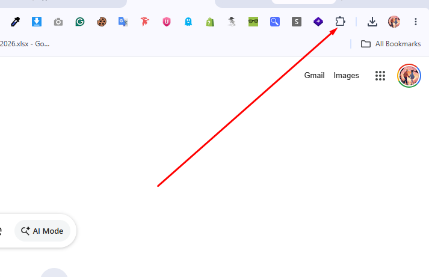
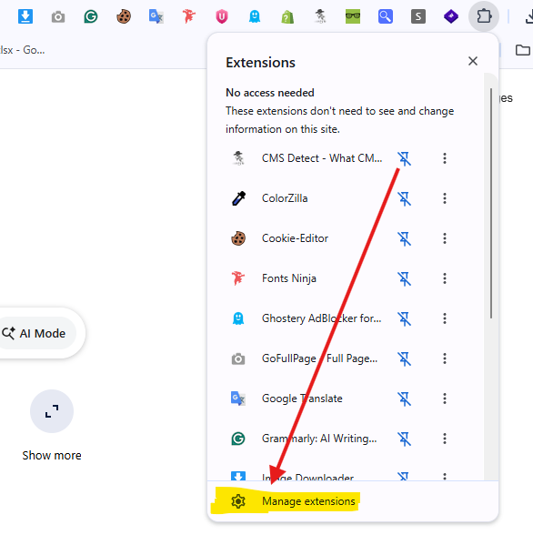
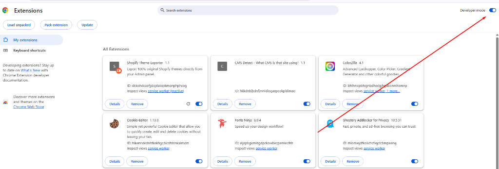
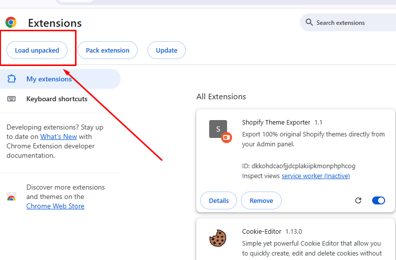
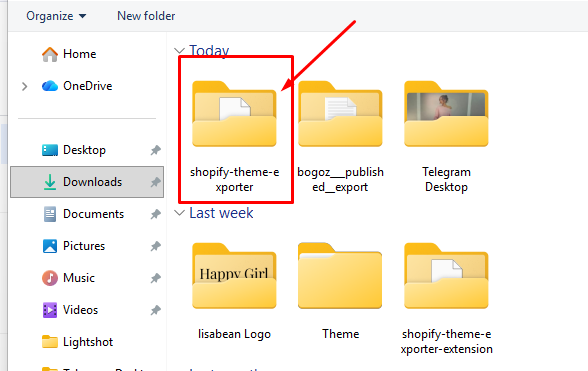

# Shopify Theme Exporter Chrome Extension

A secure, premium Chrome Extension designed to extract **100% original** Liquid, JSON, and Assets directly from your active Shopify admin session. No API passwords or private access tokens required!

---

## 🚀 Installation / সেটআপ করার নিয়ম

আপনি ২ভাবে এই এক্সটেনশনটি ইনস্টল করতে পারেন:

### পদ্ধতি ১: ZIP ফাইল ডাউনলোড করে (সহজতম উপায়)

1. এই রিপোজিটরি থেকে `shopify-theme-exporter.zip` ফাইলটি ডাউনলোড করে আপনার কম্পিউটারে আনজিপ (Extract) করুন।
2. আপনার কম্পিউটারে **Google Chrome** ব্রাউজারটি ওপেন করুন।
3. ব্রাউজারের ডানদিকের উপরে থাকা **Extensions** (🧩 পাজল আইকন) ক্লিক করুন।  
   
4. এরপর পেজের নিচে থাকা **Manage extensions** লিংকে ক্লিক করুন।  
   
5. এক্সটেনশন ম্যানেজমেন্ট পেজে গিয়ে পেজের ডানদিকের একদম উপরে থাকা **Developer mode** অপশনটি অন (ON/Enabled) করুন।  
   
6. এবার বামদিকের উপরে থাকা **Load unpacked** বাটনে ক্লিক করুন।  
   
7. একটি ফোল্ডার সিলেক্ট করার উইন্ডো আসবে। সেখান থেকে আপনার আনজিপ করা এক্সটেনশনের ফোল্ডারটি (যেখানে `manifest.json` ফাইলটি রয়েছে) সিলেক্ট করুন:  
   👉 ফোল্ডার পাথ: `c:\Users\Muhaimenul Islam\Downloads\shopify-theme-exporter-extension`  
   
8. ফোল্ডারটি সিলেক্ট করে **Select Folder** বাটনে ক্লিক করলেই এক্সটেনশনটি ইনস্টল হয়ে যাবে।
9. ইনস্টল হওয়ার পর এক্সটেনশন বার থেকে **Shopify Theme Exporter** এক্সটেনশনটি **Pin** 📌 করে নিন।

---

### পদ্ধতি ২: Git Clone করে (ডেভেলপারদের জন্য)

1. আপনার টার্মিনালে নিচের কমান্ডটি রান করে প্রজেক্টটি ক্লোন করুন:
   ```bash
   git clone https://github.com/Muhaimenul-Islam-Ratul/Shopify-theme-extractor.git
   ```
2. **Google Chrome** ওপেন করে `chrome://extensions/` পেজে যান।
3. **Developer mode** অন করুন।
4. **Load unpacked** বাটনে ক্লিক করে ক্লোন করা ফোল্ডারটি সিলেক্ট করুন।

---

## 🛠 How to Use / কীভাবে ব্যবহার করবেন

1. আপনার Shopify স্টোরের অ্যাডমিন প্যানেলে লগইন করুন (যেমন: `https://admin.shopify.com/store/YOUR-STORE` অথবা `https://YOUR-STORE-NAME.myshopify.com/admin`) এবং ট্যাবটি ওপেন রাখুন।
2. ব্রাউজার টুলবার থেকে **Shopify Theme Exporter** (📌) আইকনে ক্লিক করুন।
3. এক্সটেনশনটি আপনার স্টোর ডিটেক্ট করে ড্রপডাউনে থিমগুলোর তালিকা নিয়ে আসবে।
4. আপনার প্রয়োজনীয় থিমটি সিলেক্ট করে **Download Archive** বাটনে ক্লিক করুন।
5. ব্যাকগ্রাউন্ডে ফাইলগুলো ডাউনলোড হওয়া শুরু হবে। ডাউনলোড শেষ হলে একটি জিপ ফাইল ব্রাউজারের মাধ্যমে সরাসরি আপনার কম্পিউটারে সেভ হয়ে যাবে।

---

## 🏗 Project Structure / প্রজেক্টের ফাইলসমূহ

- **`manifest.json`**: এক্সটেনশনটির কনফিগারেশন ফাইল (Manifest V3)।
- **`popup.html`**: এক্সটেনশনের ইউজার ইন্টারফেস (UI)।
- **`popup.css`**: প্রিমিয়াম ডার্ক-মোড স্টাইলিং ও গ্লাস মরফিজম অ্যানিমেশন।
- **`popup.js`**: এক্সটেনশন পপআপের লজিক এবং ইন-ট্যাব স্ক্রিপ্ট ম্যানেজার।
- **`content.js`**: মূল স্ক্রিপ্ট যা স্টোরের সেশন ব্যবহার করে ফাইলগুলো ডাউনলোড ও জিপ করে।
- **`jszip.min.js`**: ফাইল কম্প্রেস করার জন্য ব্যবহৃত জাভাস্ক্রিপ্ট লাইব্রেরি।
- **`shopify-theme-exporter.zip`**: ডিস্ট্রিবিউশন জিপ ফাইল যা দিয়ে এক্সটেনশনটি ইনস্টল করা যায়।
- **`images/`**: সেটআপ গাইড ইলাস্ট্রেট করার জন্য ব্যবহৃত স্ক্রিনশটসমূহ।
